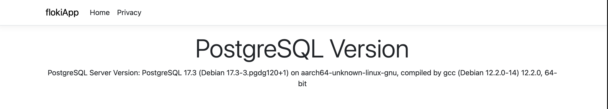

# Floki Dotnet App

## Prerequisites

- [Cloud Foundry CLI](https://docs.cloudfoundry.org/cf-cli/install-go-cli.html)
- [.NET 8 SDK](https://dotnet.microsoft.com/en-us/download/dotnet/8.0) (at minimum. tested with 8.0.8)
- [VCAP_SERVICES](https://docs.cloudfoundry.org/devguide/deploy-apps/environment-variable.html#VCAP-SERVICES)

## Running locally

```bash
cp .env.example .env
# update .env with your own values

dotnet run
```

## Deploying

```bash
cf create-user-provided-service mypg -p '{"host":"your_host", "database":"your_db", "username":"your_username", "password":"your_password", "port":5432}'

cf push
```

## Building & deploying as a self-contained deployment
```sh
dotnet publish -c Release -r linux-x64 --self-contained true -o ./publish

cf push <new app name>-p ./publish
```

## Screenshot


